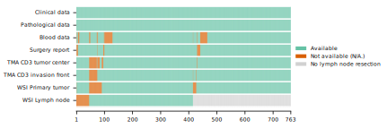
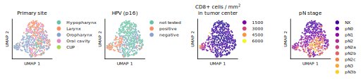
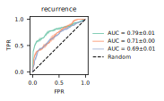
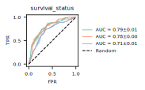
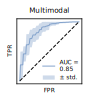
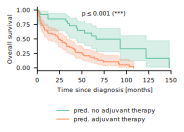
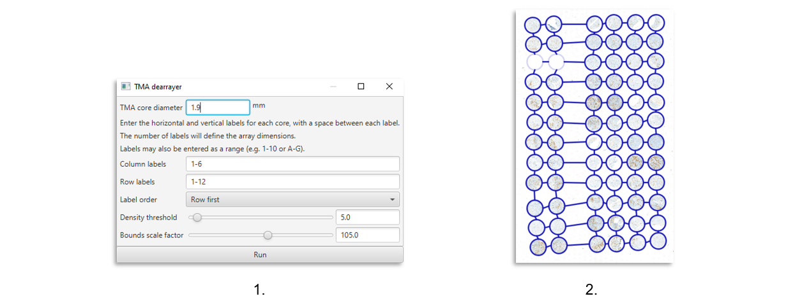
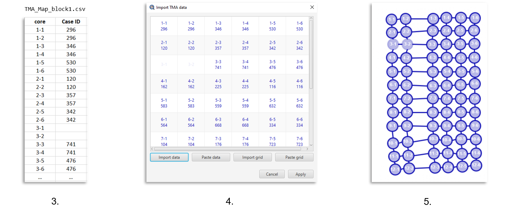

# Multimodal head and neck cancer dataset

[Website](https://hancock.research.fau.eu/) | [Dataset download](https://hancock.research.fau.eu/download) | [Cite](#reference)

This repository contains code for exploring the multimodal head and neck cancer dataset HANCOCK and for
training Machine Learning models to predict outcomes and treatment choices. We also provide strategies for 
multimodal data handling, feature extraction, and generating train/test dataset splits. 


## Table of contents
* [Setup](#setup)
* [Dataset](#dataset)
* [Multimodal feature extraction](#multimodal-feature-extraction)
* [Generating data splits](#generating-data-splits)
* [Outcome prediction](#outcome-prediction)
* [Adjuvant treatment prediction](#adjuvant-treatment-prediction)
* [Adjuvant treatment prediction using histology images](#adjuvant-treatment-prediction-using-histology-images)
* [Reference](#reference)


## Setup
To set up the environment, first clone this repository to your local machine and create a directory for storing
the results:
```
git clone https://github.com/ankilab/HANCOCK_MultimodalDataset.git
cd HANCOCK_MultimodalDataset
mkdir results
```
Next, set up an Anaconda environment and install the required Python packages:
```
conda create -n hancock_multimodal python=3.12
conda activate hancock_multimodal
pip install -r requirements.txt
```

Our code was tested on Ubuntu-24.04 with an NVIDIA RTX 4060 besides the additional section
[Adjuvant treatment prediction using histology images](#adjuvant-treatment-prediction-using-histology-images),
which was tested on Windows.
For running the code described the section 
[Adjuvant treatment prediction using histology images](#adjuvant-treatment-prediction-using-histology-images),
TensorFlow 2.16 is used (see `requirements.txt`). Furthermore, [QuPath](https://qupath.github.io/) needs to be installed 
for the analysis of histology data.

## Dataset
The dataset can be explored and downloaded at our project website: https://hancock.research.fau.eu/

The dataset is structured in ZIP archives. If all archives are downloaded and unzipped, the dataset is
structured as follows:

```
Hancock_Dataset
|
├── StructuredData
|   ├── blood_data.json
|   ├── blood_data_reference_ranges.json
|   ├── clinical_data.json
|   └── pathological_data.json
|
├── TextData
|   ├── histories
|   ├── histories_english
|   ├── icd_codes
|   ├── ops_codes
|   ├── reports
|   ├── reports_english
|   ├── surgery_descriptions
|   └── surgery_descriptions_english
|
├── DataSplits_DataDictionaries
|   ├── DataDictionary_blood.csv
|   ├── DataDictionary_clinical.csv
|   ├── DataDictionary_pathological.csv
|   ├── dataset_split_in.json
|   ├── dataset_split_out.json
|   ├── dataset_split_Oropharynx.json
|   └── dataset_split_treatment_outcome.json
|
├── TMA_CellDensityMeasurements
|   └── TMA_celldensity_measurements.csv
|
├── TMA_InvasionFront
├── TMA_TumorCenter
├── TMA_Maps
├── WSI_LymphNode
├── WSI_PrimaryTumor_Annotations
└── WSI_PrimaryTumor_[Site]
```

However, it is sufficient to download the following folders for reproducing most results from our paper:
`StructuredData`, `TextData`, `DataSplits_DataDictionaries`, `TMA_CellDensityMeasurements`.

To reproduce our results described in section 
[Adjuvant treatment prediction using histology images](#adjuvant-treatment-prediction-using-histology-images), 
it is also required to download Tissue Microarrays (TMAs): `TMA_TumorCenter` and `TMA_Maps`.

However, if one is only interested in reproducing the final predictions (adjuvant therapy and outcome) and 
does not want to reproduce the feature extraction and data splitting, it is possible to rely solely on the 
features found in the [`features`](features) directory of this repository together with the additional to be downloaded
[`DataSplits_DataDictionaries`](https://data.fau.de/public/24/87/322108724/DataSplits_DataDictionaries.zip) from the 
dataset.

### Disclaimer
We expect the user to use the structure presented in the [Dataset](#dataset) section, 
and additionally to locate the repository in the same directory as the directory that contains 
the `Hancock_Dataset'.
```
Parent_Directory
├── Hancock_Dataset
|   ├── ...
|
├── HANCOCK_MultimodalDataset
|   ├── ...
```

This makes it easier to run the scripts without specifying the paths to the data directory. 
If you do not want to follow this structure, you can either change the default paths 
in the file `./defaults/__init__.py` or set them manually each time the scripts are called. 
Note that you do not have to set every argument, just the ones that differ from the recommended structure.

To check which options are available, you can run e.g.
```
python3 ./data_exploration/plot_available_data.py --help
```
The following assumes that the recommended structure is used.


### Data exploration
We provide a jupyter notebook `exploring_tabular_data.ipynb` for visualizing the structured 
(clinical, pathological, and blood) data.
The jupyter notebook `survival_analysis.ipynb` can be used to reproduce Kaplan-Meier curves.
You might need to adjust the path `data_dir` which should point to the directory that contains 
the structured data (JSON files).

To visualize which modalities are available for how many out of the 763 patients, run the following script:
```
cd data_exploration
python3 plot_available_data.py
```



## Multimodal feature extraction
This step is optional, as we already provide the extracted features in the `feature' directory. 

To better understand the multimodal data, we extracted features from different modalities and concatenated them to
vectors, termed multimodal patient vectors. These vectors were used for the following:
* For visualizing the data in 2D
* For generating train/test data splits
* For training Machine Learning models

Features are extracted from demographical, pathological, and blood data (structured data), ICD codes (text data), 
and intratumoral density of CD3- and CD8-positive cells that was computed from TMAs (image data).


Run `create_multimodal_patient_vectors.py` to extract features and create multimodal patient vectors:
```
cd feature_extraction

python3 create_multimodal_patient_vectors.py 
```

After running this script, a 2D representation of the multimodal patient vectors can be visualized using the
jupyter notebook `umap_visualization.ipynb` in the `data_exploration` folder.




## Generating data splits
Performing this step is optional, as we provide the data splits on the download page of the 
[HANCOCK dataset](https://data.fau.de/public/24/87/322108724/DataSplits_DataDictionaries.zip).

We implemented a genetic algorithm to find different data splits, where the data is split into a training and a test set.
You can directly use the data splits provided in our dataset, in "DataSplits_DataDictionaries".

Alternatively, if you would like to run the genetic algorithm to reproduce these splits, you can
use the code in the folder [data_splitting](data_splitting) to create the dataset splits.
Run the following code to create different data splits: Run `genetic_algorithm` to generate a split where the test dataset 
contains either in-distribution data or out-of-distribution data using `--in` or `--out`, respectively.
A dataset split by primary tumor site can be generated using `split_by_tumor_site.py`.
All cases with the specified site are assigned to the test dataset and the remaining cases
are assigned to the training dataset.
Running `split_by_treatment_outcome.py` assigns cases to the test dataset where no adjuvant
treatment was used but an event occurred, including recurrence, metastasis, progress, or death.
The remaining cases are assigned to the training dataset.

```
cd data_splitting

python3 genetic_algorithm.py ../features ../results in_distribution_test_dataset --in
python3 genetic_algorithm.py ../features ../results out_of_distribution_test_dataset --out
python3 split_by_tumor_site.py path/to/Hancock_Dataset/StructuredData ../results -s Oropharynx
python3 split_by_treatment_outcome.py ./../../Hancock_Dataset/StructuredData ../results 
```

## Outcome prediction
Run `outcome_prediction.py` to reproduce results of training a Machine Learning classifier
on the multimodal patient vectors to predict recurrence and survival status.
The classifier is trained five times on the different data splits. Plots of the data splits (2D representation)
and of Receiver-Operating Characteristic (ROC) curves are saved to the results directory.

```
cd mulitmodal_machine_learning`
python3 outcome_prediction.py ./../../Hancock_Dataset/DataSplits_DataDictionaries  ../features ../results recurrence 
python3 outcome_prediction.py ./../../Hancock_Dataset/DataSplits_DataDictionaries ../features ../results survival_status
```



## Adjuvant treatment prediction
Run `adjuvant_treatment_prediction.py` to reproduce results of training a Machine Learning classifier
to predict the treatment choice, i.e. whether an adjuvant treatment is needed. This script trains models on single modalities and on the multimodal data using 10-fold cross-validation. Finally, the multimodal model is trained on the full training dataset. Its predictions for the test data are explained
using [shap](https://github.com/shap/shap) values and a summary plot. 
Kaplan-Meier curves (overall and recurrence-free survival) are plotted for cases grouped by predictions.

```
cd multimodal_machine_learning
python3 adjuvant_treatment_prediction_tabular_only.py
```






## Adjuvant treatment prediction using histology images
Steps one through four presented in this section are optional, as we make the features extracted by these steps 
available in the [`features`](features) directory.

We used the open-source histology software QuPath for analyzing TMAs. 
The folder [qupath_scripts](qupath_scripts) contains code that can be executed in QuPath's script editor. 
You can run the following scripts for all TMAs at once by selecting <kbd>Run</kbd>><kbd>Run for project</kbd>.
For more information about scripting in QuPath, check the [documentation](https://qupath.readthedocs.io/en/stable/docs/scripting/overview.html).

**Step 1: Creating QuPath projects**

Create one empty directory for each immunohistochemistry marker, named "TMA_CD3", "TMA_CD8", "TMA_CD56", and so on:
```
QuPathProjectsDirectory
├── TMA_CD3
├── TMA_CD8
├── TMA_CD56
├── TMA_CD68
├── TMA_CD163
├── TMA_HE
├── TMA_MHC1
└── TMA_PDL1
```
Next, create a QuPath project from each of these folders and import the corresponding TMAs.
For example, click <kbd>Create Project</kbd>, select the directory "TMA_CD3" and import all SVS files from the folder "Hancock_Dataset/TMA_TumorCenter/CD3".
> [!IMPORTANT]  
> Set "Rotate Image" to 180 degrees for all TMAs in QuPath's import dialog.


**Step 2: TMA dearraying**

Open `dearray_tma.groovy` in QuPath's script editor and click <kbd>Run for project</kbd>. This will create a grid of 6 columns x 12 rows 
for locating the TMA cores within the image.  Next, you can run `check_tma_grid_size.groovy` to check for any incorrect 
grid sizes. You might need to manually adjust some grids. 

Next, open `import_tma_map.groovy` in the script editor and click <kbd>Run for project</kbd> to import the TMA maps. 
When prompted, select the folder "TMA_Maps" provided in our dataset. The patient ID can then be found as "Case ID" in QuPath.

> [!NOTE]
> Each TMA contains tissue cores of several patients. 
> In QuPath, **TMA maps** must be imported to assign patient IDs to tissue cores.
> You can run our scripts (see [qupath_scripts](qupath_scripts)) which automate the required steps for dearraying and
> importing TMA maps.
> 
> However, if you would like to manually analyze a TMA, you can perform the following steps:
> 
> 1) With a TMA opened in QuPath, run the TMA dearrayer (<kbd>TMA</kbd>><kbd>TMA dearrayer</kbd>) with a core diameter of 1.9 mm, 
> column labels 1-6 and row labels 1-12 
> 2) A grid has been created and might need manual adjustments 
> 3) A TMA map e.g. "TMA_Map_block1.csv" contains the core coordinates of the 12 x 6 grid and patient IDs (Case IDs)
> 4) Click <kbd>File</kbd>><kbd>TMA data</kbd>><kbd>Import TMA map</kbd>><kbd>Import data</kbd> and select the TMA map
> 5) Each TMA core is now associated with the correct patient ID
>
> 
> 
> 
> For learning more about TMA dearraying, we recommend reading
> [this guide](https://github.com/qupath/qupath/wiki/TMA-CD3-analysis).


**Step 3: Extracting tiles**

Next, run `export_centertiles_from_tma_cores.groovy` to extract one tile from the center of each TMA core. The images
are saved as PNG files to the directory `path/to/your_qupath_project/tiles`. Each tile's filename is built as follows:
`<patient_id>_core<core_index>_tile.png`


**Step 4: Extracting image features**

To extract features from images (TMA core tiles), run `extract_tma_image_features.py`.
We use [deeptexture](https://github.com/dakomura/deep_texture_histology) for feature extraction. This package requires
Python version <= 3.8.15. Therefore, we recommend to run this script in another environment.
```
conda create -n deeptexture_env python=3.8.15
conda activate deeptexture_env
pip install deeptexture tqdm opencv-python

cd feature_extraction
python extract_tma_image_features.py path/to/QuPathProjectsDirectory ../features
```

**Optional: Counting immune cells**

The intratumoral density of CD3- and CD8-positive cells was already computed and is provided in the dataset folder
"TMA_CellDensityMeasurements". However, if you would like to reproduce these measurements, you can perform the following steps:

Copy the pixel classifier from this repository to your project:
```
cd path/to/your_qupath_project/classifiers
mkdir pixel_classifiers
cp qupath_scripts/tissueDetection.json pixel_classifiers
``` 
Next, run `detect_tissue_in_tma_cores.groovy`. 
 
To improve the subsequent counting of positive cells, you can manually remove possible artifacts from the 
resulting detection objects, for example using the brush tool while holding down the `ALT` key. However, this is optional.

Run `tma_measure_positive_cells.groovy`. This script first makes sure that the grid labels and object hierarchy
are correct, in case the objects were manually adjusted (e.g. for artifact removal). Next, it runs QuPath's
plugin for positive cell detection and imports TMA maps to match cores to patient IDs. Finally, the cell counts
and other measurements are exported as CSV files to the directory `path/to/your_qupath_project/tma_measurements`.
Hint: The QuPath script will prompt you to select the directory containing the TMA maps. To avoid the prompt showing 
for every single TMA, you can set the variable `tma_map_dir` in the script.

Next, run `summarize_tma_measurements.py` to create a single file by merging all TMA measurement files from step 4.

**Step 5: Training and testing a deep neural network**

Run `adjuvant_treatment_prediction_convnet.py` to reproduce results of training a Convolutional Neural Network
to predict whether an adjuvant treatment is used:
```
conda create -n hancock_multimodal_win python=3.9
conda activate hancock_multimodal_win
pip install -r windows_requirements.txt
cd multimodal_machine_learning
python adjuvant_treatment_prediction_convnet.py
```

**Step 6 (Alternative): Training and testing a deep neural network**
Run `adjuvant_treatment_prediction_tma_vector.py` to reproduce results of training 
an attention-coupled multi-layer perceptron to predict whether an adjuvant treatment is used.
This was again tested on Ubuntu-24.04 with an NVIDIA RTX 4060.
```
cd multimodal_machine_learning
python3 adjuvant_treatment_prediction_tma_vector.py
```

# Reference
Dörrich, Marion, et al. "A multimodal dataset for precision oncology in head and neck cancer." medRxiv (2024): 2024-05.
doi: https://doi.org/10.1101/2024.05.29.24308141
```
@article{doerrich2024multimodal,
  title={A multimodal dataset for precision oncology in head and neck cancer},
  author={D{\"o}rrich, Marion and Balk, Matthias and Heusinger, Tatjana and Beyer, Sandra and Kanso, Hassan and Matek, Christian and Hartmann, Arndt and Iro, Heinrich and Eckstein, Markus and Gostian, Antoniu-Oreste and others},
  journal={medRxiv},
  pages={2024--05},
  year={2024},
  publisher={Cold Spring Harbor Laboratory Press}
}
```