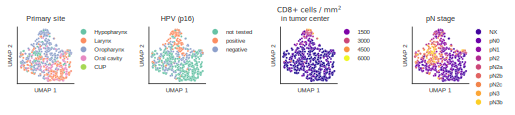

# Multimodal head and neck cancer dataset

[Website](https://hancock.research.fau.eu/) | [Dataset download](https://hancock.research.fau.eu/download) | [Cite](#reference)

This repository contains code for exploring the multimodal head and neck cancer dataset HANCOCK and for
training Machine Learning models to predict outcomes and treatment choices. We also provide strategies for 
multimodal data handling, feature extraction, and generating train/test dataset splits. 


## Table of contents
* [Setup](#setup)
* [Dataset](#dataset)
* [Multimodal feature extraction](#multimodal-feature-extraction)
* [Generating data splits](#generating-data-splits)
* [Outcome prediction](#outcome-prediction)
* [Reference](#reference)


## Setup
To set up the environment, first clone this repository to your local machine and create a directory for storing
the results:
```
git clone https://github.com/ankilab/HANCOCK_MultimodalDataset.git
cd HANCOCK_MultimodalDataset
mkdir results
```
Next, set up an Anaconda environment and install the required Python packages:
```
conda create -n hancock_multimodal python=3.12
conda activate hancock_multimodal
pip install -r requirements.txt
```

Our code was tested on Ubuntu-24.04 with an NVIDIA RTX 4060 besides the additional section
[Adjuvant treatment prediction using histology images](#adjuvant-treatment-prediction-using-histology-images),
which was tested on Windows.
For running the code described the section 
[Adjuvant treatment prediction using histology images](#adjuvant-treatment-prediction-using-histology-images),
TensorFlow 2.16 is used (see `requirements.txt`). Furthermore, [QuPath](https://qupath.github.io/) needs to be installed 
for the analysis of histology data.


## Dataset
The dataset can be explored and downloaded at our project website: https://hancock.research.fau.eu/

The dataset is structured in ZIP archives. If all archives are downloaded and unzipped, the dataset is
structured as follows:

```
Hancock_Dataset
|
├── StructuredData
|   ├── blood_data.json
|   ├── blood_data_reference_ranges.json
|   ├── clinical_data.json
|   └── pathological_data.json
|
├── TextData
|   ├── histories
|   ├── histories_english
|   ├── icd_codes
|   ├── ops_codes
|   ├── reports
|   ├── reports_english
|   ├── surgery_descriptions
|   └── surgery_descriptions_english
|
├── DataSplits_DataDictionaries
|   ├── DataDictionary_blood.csv
|   ├── DataDictionary_clinical.csv
|   ├── DataDictionary_pathological.csv
|   ├── dataset_split_in.json
|   ├── dataset_split_out.json
|   ├── dataset_split_Oropharynx.json
|   └── dataset_split_treatment_outcome.json
|
├── TMA_CellDensityMeasurements
|   └── TMA_celldensity_measurements.csv
|
├── TMA_InvasionFront
├── TMA_TumorCenter
├── TMA_Maps
├── WSI_LymphNode
├── WSI_PrimaryTumor_Annotations
|
|── WSI_PrimaryTumor
|   └── WSI_PrimaryTumor_[Site]
```

However, it is sufficient to download the following folders for reproducing most results from our paper:
`StructuredData`, `TextData`, `DataSplits_DataDictionaries`, `TMA_CellDensityMeasurements`.

However, if one is only interested in reproducing the final predictions (outcome) and 
does not want to reproduce the feature extraction and data splitting, it is possible to rely solely on the 
features found in the [`features`](features) directory of this repository together with the additional to be downloaded
[`DataSplits_DataDictionaries`](https://data.fau.de/public/24/87/322108724/DataSplits_DataDictionaries.zip) from the 
dataset.

### Disclaimer
We expect the user to use the structure presented in the [Dataset](#dataset) section, 
and additionally to locate the repository in the same directory as the directory that contains 
the `Hancock_Dataset'.
```
Parent_Directory
├── Hancock_Dataset
|   ├── ...
|
├── HANCOCK_MultimodalDataset
|   ├── ...
```

This makes it easier to run the scripts without specifying the paths to the data directory. 
If you do not want to follow this structure, you can either change the default paths 
in the file `./defaults/__init__.py` or set them manually each time the scripts are called. 
Note that you do not have to set every argument, just the ones that differ from the recommended structure.

To check which options are available, you can run e.g.
```
python3 ./data_exploration/plot_available_data.py --help
```
The following assumes that the recommended structure is used.


### Data exploration
We provide a jupyter notebook `exploring_tabular_data.ipynb` for visualizing the structured 
(clinical, pathological, and blood) data.
The jupyter notebook `survival_analysis.ipynb` can be used to reproduce Kaplan-Meier curves.
You might need to adjust the path `data_dir` which should point to the directory that contains 
the structured data (JSON files).

To visualize which modalities are available for how many out of the 763 patients, run the following script:
```
cd data_exploration
python3 plot_available_data.py
```


## Multimodal feature extraction
This step is optional, as we already provide the extracted features in the `feature' directory. 

To better understand the multimodal data, we extracted features from different modalities and concatenated them to
vectors, termed multimodal patient vectors. These vectors were used for the following:
* For visualizing the data in 2D
* For generating train/test data splits
* For training Machine Learning models

Features are extracted from demographical, pathological, and blood data (structured data), ICD codes (text data), 
and intratumoral density of CD3- and CD8-positive cells that was computed from TMAs (image data).


Run `create_multimodal_patient_vectors.py` to extract features and create multimodal patient vectors:
```
cd feature_extraction

python3 create_multimodal_patient_vectors.py 
```

After running this script, a 2D representation of the multimodal patient vectors can be visualized using the
jupyter notebook `umap_visualization.ipynb` in the `data_exploration` folder.




## Generating data splits
Performing this step is optional, as we provide the data splits on the download page of the 
[HANCOCK dataset](https://data.fau.de/public/24/87/322108724/DataSplits_DataDictionaries.zip).

We implemented a genetic algorithm to find different data splits, where the data is split into a training and a test set.
You can directly use the data splits provided in our dataset, in "DataSplits_DataDictionaries".

Alternatively, if you would like to run the genetic algorithm to reproduce these splits, you can
use the code in the folder [data_splitting](data_splitting) to create the dataset splits.
Run the following code to create different data splits: Run `genetic_algorithm` to generate a split where the test dataset 
contains either in-distribution data or out-of-distribution data using `--in` or `--out`, respectively.
A dataset split by primary tumor site can be generated using `split_by_tumor_site.py`.
All cases with the specified site are assigned to the test dataset and the remaining cases
are assigned to the training dataset.
Running `split_by_treatment_outcome.py` assigns cases to the test dataset where no adjuvant
treatment was used but an event occurred, including recurrence, metastasis, progress, or death.
The remaining cases are assigned to the training dataset.

```
cd data_splitting

python3 genetic_algorithm.py ../features ../results in_distribution_test_dataset --in
python3 genetic_algorithm.py ../features ../results out_of_distribution_test_dataset --out
python3 split_by_tumor_site.py path/to/Hancock_Dataset/StructuredData ../results -s Oropharynx
python3 split_by_treatment_outcome.py ./../../Hancock_Dataset/StructuredData ../results 
```


## Outcome prediction
Run `outcome_prediction.py` to reproduce results of training a Machine Learning classifier
on the multimodal patient vectors to predict recurrence and survival status.
The classifier is trained five times on the different data splits. Plots of the data splits (2D representation)
and of Receiver-Operating Characteristic (ROC) curves are saved to the results directory.

```
cd mulitmodal_machine_learning
python3 outcome_prediction.py ./../../Hancock_Dataset/DataSplits_DataDictionaries  ../features ../results recurrence 
python3 outcome_prediction.py ./../../Hancock_Dataset/DataSplits_DataDictionaries ../features ../results survival_status
```


# Reference
Dörrich, Marion, et al. "A multimodal dataset for precision oncology in head and neck cancer." medRxiv (2024): 2024-05.
doi: https://doi.org/10.1101/2024.05.29.24308141
```
@article{doerrich2024multimodal,
  title={A multimodal dataset for precision oncology in head and neck cancer},
  author={D{\"o}rrich, Marion and Balk, Matthias and Heusinger, Tatjana and Beyer, Sandra and Kanso, Hassan and Matek, Christian and Hartmann, Arndt and Iro, Heinrich and Eckstein, Markus and Gostian, Antoniu-Oreste and others},
  journal={medRxiv},
  pages={2024--05},
  year={2024},
  publisher={Cold Spring Harbor Laboratory Press}
}
```